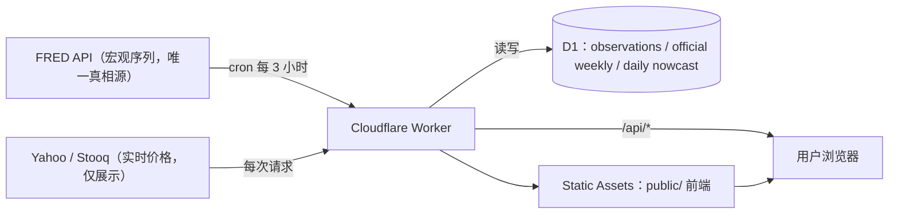
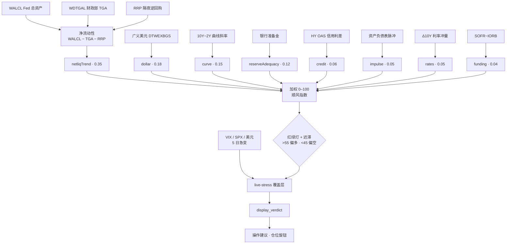

# 美股流动性看板 · Macro Liquidity Dashboard

> 用美联储的「钱多钱少」判断美股顺不顺风。**净流动性 + 9 个加权因子** → **0–100 顺风指数** 和 **偏多 / 中性 / 偏空** 红绿灯,外加**实时风控覆盖层**和**「操作建议 · 仓位旋钮」**。

🔗 **在线**:https://macro-liquidity-dashboard.pp-account.workers.dev
📄 **算法说明(站内)**:[`/algorithm`](https://macro-liquidity-dashboard.pp-account.workers.dev/algorithm) · 全文 [`docs/ALGORITHM.md`](docs/ALGORITHM.md)

> ⚠️ **诚实定位**:这是一个**弱信号的宏观环境 / 风控仪表盘,不是择时预言机**。方向命中率仅 **~52%**(被市场 ~76% 的上涨漂移钳死),真正价值在 **IC / Sharpe 的风险排序**,不在猜涨跌。详见 [§ 诚实定位](#-诚实定位为什么别盯命中率)。**仅供研究 / 教育,不构成投资建议。**

---

## 这是什么

起点是一份 TradingView Pine 脚本(Ultimate Macro Command Center),改造成独立网页 dashboard:把美联储**净流动性**(QE/QT 背后真正驱动股市的「水位」)和一组宏观因子,合成一个对 **S&P 500** 环境的判断 —— 顺风(可多)、逆风(收一收)还是中性。核心卖点是把「**缩表却放水 / 扩表却收水**」这种**背离**显式讲出来,并配一套诚实的样本外验证。

---

## 架构



- **单个 Cloudflare Worker** 托管前端(Workers Static Assets)、`/api/*` 接口和每日 `cron`。
- **FRED = 历史与逻辑的唯一真相源**;实时价格(Yahoo 主 / Stooq 备)只贴顶部当前数字、**不入库**(口径隔离)。
- **D1**(SQLite)分别存观测值、正式周频快照与 `PROVISIONAL` 日频 nowcast；`cron` 每 3 小时增量更新 nowcast，正式历史只由全量重建写入。

---

## 算法

### 1）净流动性

```
净流动性 = WALCL（Fed 总资产) − TGA（WDTGAL，财政部账户) − RRP（隔夜逆回购)
```

钱从 Fed 资产负债表流出、但被 TGA 重建或 RRP 抽走,股市拿到的「净水位」其实在降 —— 这就是看板要抓的背离。

### 2）9 个加权因子(权重由 10 年回测的因子 IC 校准,非按 IC 硬拟合)

| 因子 | 权重 | 13w IC | 直觉 |
|---|--:|--:|---|
| **netliqTrend** | 0.35 | +0.19 | 净流动性 13 周趋势(最强核心) |
| **dollar** | 0.18 | +0.16 | 弱美元 → 顺风 |
| **curve** | 0.15 | +0.17 | 收益率曲线(10Y−2Y)走陡 → 顺风 |
| **reserveAdequacy** | 0.12 | +0.12 | 银行准备金充裕度(RRP 见底后的新缓冲) |
| **credit** | 0.06 | −0.03 | HY 信用利差(level/momentum/fragility 三拆) |
| **impulse** | 0.05 | +0.08 | 资产负债表脉冲(扩/缩/平) |
| **rates** | 0.05 | +0.06 | Δ10Y 利率冲量(快速上冲 = 逆风) |
| **funding** | 0.04 | −0.04 | SOFR−IORB 资金压力 |
| **vol** | 0.00 | −0.25 | 稳健反指 → **移出打分**,进风控层 |

`score = clamp(Σ 因子 × 权重)` ∈ [0,100]。**红绿灯 + 迟滞**:`>55` 偏多,`<45` 偏空,`45–55` 维持上一日(死区防抖)。

### 3)评分流程



### 4)live-stress 实时风控覆盖层

近 5 个交易日任一触发(`VIX>28` / `SPX 5日<−4%` / `10Y 5日>+0.25pp` / `美元 5日>+2%`)→ 把**显示**结论降一级(偏多→中性→偏空),但**宏观 score 不变、不入库**。强环境(score≥65)压过短期噪音、不降级。

### 5)操作建议 · 仓位旋钮

把读数翻译成**相对基准的仓位档**(不假设你的具体仓位):偏多+净流动性在放 → `基准 +15~20pp`;中性 → `基准`;偏空+净流动性在收 → `基准 −15~20pp`;stress 触发 → `刹车`。并给出背离提示和两个触发点(分数跌破 45 / stress 触发)。

---

## 🎯 诚实定位(为什么别盯命中率)

| 前瞻 | 市场上涨比例(=「永远做多」命中率) | 本模型方向命中 |
|---|--:|--:|
| 13 周 | **76.2%** | ~52% |

市场大多数时候在涨,所以**方向命中率是个误导性指标** —— 想把它拉到 76% 的唯一办法是让模型永远偏多,那就废了。**本模型的价值在排序 / 风控**:它更看空时,未来收益更低、回撤更集中 —— 这被 **IC(综合 +0.255 @13w)** 和 **Sharpe(1.10,风险调整后跑赢买入持有)** 捕捉。**正确的记分牌是 IC / Sharpe / 躲回撤,不是命中率。**

---

## 验证(诚实的样本外检验)

- **`/api/backtest`** —— 对 4/8/13 周 SPX forward return 算综合分 IC、命中率、逐因子 IC、long/flat 策略 Sharpe。阈值固定 + percentile expanding-window(无前视)。
- **`/api/walkforward`** —— 扩窗 train → embargo → OOS test 滚动,三臂对比(WF 自动拟合 / 等权 / 当前手调)。**裁决:自动调权过拟合;等权 ≈ 手调;edge 在因子选择不在精确权重。**
- **综合 IC@13w 轨迹**:`0.127 → 0.195 → 0.208 → 0.227 → 0.255`,**Sharpe 0.83 → 1.10**,每步有回测撑腰。
- **负结果归档(`docs/ALGORITHM.md` §10)**:测过「全球央行流动性(Fed+ECB+BOJ)领先美股」—— 24 年两种构造都**弱、regime 不稳、不比 Fed-only 强 → 不采用**。离线研究脚本见 [`scripts/`](scripts/)。

---

## 数据源(FRED)

| 序列 | 含义 | 用途 |
|---|---|---|
| `WALCL` | Fed 总资产 | 净流动性 + 脉冲 |
| `WDTGAL` / `WTREGEN` | 财政部 TGA | 净流动性 |
| `RRPONTSYD` / `RPONTSYD` | 隔夜逆回购 / 回购 | 净流动性 |
| `WRBWFRBL` | 银行准备金 | reserveAdequacy |
| `SOFR` / `IORB` | 担保隔夜 / 准备金利率 | 资金面 |
| `BAMLH0A0HYM2` | HY OAS 信用利差 | credit |
| `DGS10` / `T10Y2Y` | 10Y 收益率 / 曲线斜率 | rates / curve |
| `DTWEXBGS` | 广义美元 | dollar |
| `VIXCLS` | VIX | 风控层 |
| `SP500` | 标普 500 | 历史图 + 回测 |

> ⚠️ 单位坑:`WALCL`/`WDTGAL`/`WTREGEN`/`WRBWFRBL` 来自 H.4.1 是**百万**;`RRPONTSYD`/`RPONTSYD` 来自临时公开市场操作是**十亿**。

---

## 技术栈

- **Cloudflare Worker**(TypeScript)+ **Workers Static Assets** + **D1**(SQLite)+ **Cron Triggers**
- 数据:**FRED**(宏观)+ **Yahoo / Stooq**(实时价格)
- 前端:原生 HTML / CSS / JS + 自托管 [Lightweight-Charts](https://github.com/tradingview/lightweight-charts),仿 Stripe 纯色风格
- 测试:**Vitest**(176 测试,纯逻辑全在 `src/metrics.ts`)
- 部署:`wrangler`

---

## 项目结构

```
src/
  metrics.ts      纯函数打分大脑(computeSnapshot / 各 scoreXxx / buildGuidance)
  config.ts       SERIES / WEIGHTS / 阈值
  backtest.ts     /api/backtest（IC / 命中率 / Sharpe）
  walkforward.ts  /api/walkforward（样本外裁决）
  service.ts      FRED 增量 / 回填流水线
  worker.ts       路由 + snapshot 组装（display_verdict / live_stress / guidance）
  db.ts           D1 读写
public/           前端：index.html / app.js / styles.css / algorithm.html
docs/             ALGORITHM.md（算法全文）/ ROADMAP / qeqt（分析师评审）
scripts/          全球流动性长史研究（离线，Fed+ECB+BOJ vs SPX）
test/             Vitest
migrations/       D1 schema（observations + official weekly + provisional daily nowcast）
```

---

## API

| 端点 | 说明 |
|---|---|
| `GET /api/snapshot` | 显式 `official` 正式信号 + `nowcast` 周中预估(`PROVISIONAL`) + guidance + live_stress |
| `GET /api/history?from=YYYY-MM-DD` | 正式周频净流动性 / SPX 历史(画图用) |
| `GET /api/prices` | 实时价格(Yahoo/Stooq) |
| `GET /api/backtest` | IC / 命中率 / 逐因子 IC / 策略 Sharpe |
| `GET /api/walkforward` | 样本外三臂裁决 |
| `POST /api/admin/refresh` | 回填(Bearer `ADMIN_TOKEN`;`?all=1` 全量) |

---

## 本地开发

```bash
npm install
# 准备密钥(已 gitignore,切勿提交)
printf 'FRED_API_KEY=你的key\nADMIN_TOKEN=随便一个长随机串\n' > .dev.vars
npm test            # Vitest
npx wrangler dev    # 本地起 Worker
```

部署:`npx wrangler deploy`(D1 需先 `wrangler d1 migrations apply`,密钥用 `wrangler secret put`)。

---

## 免责声明

本项目仅作**研究与教育**用途,**不构成任何投资建议**。模型是弱信号宏观仪表盘,请勿据其单次信号 all-in / all-out,并结合你自己的风险管理与判断。

**作者:[YSKM523](https://github.com/YSKM523)**

---

## 许可 License

[MIT](LICENSE) © 2026 YSKM523
